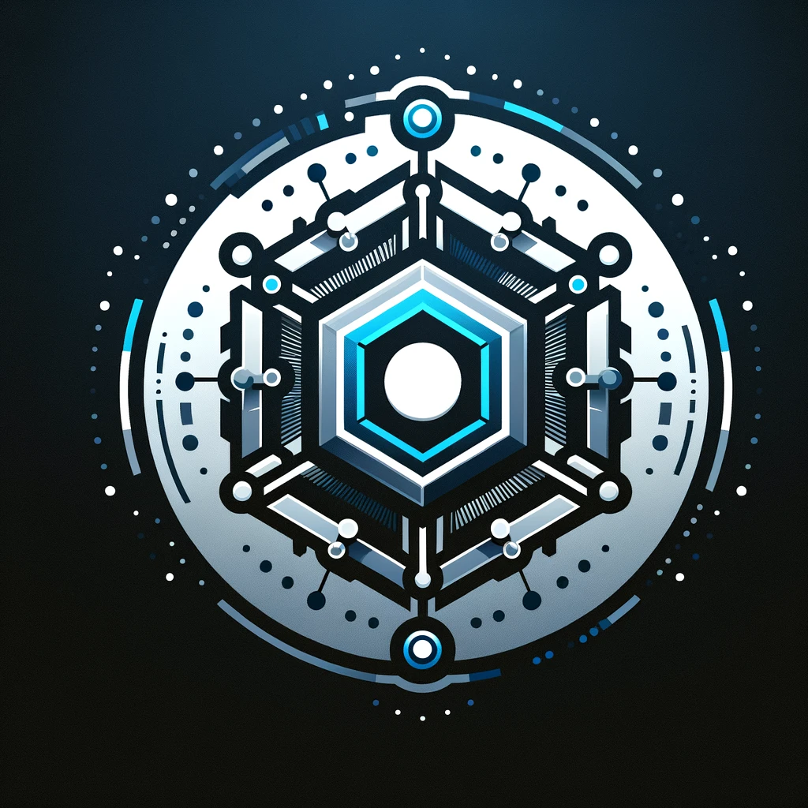

# CoreLedger: _A Personal Blockchain Experiment_

## Introduction

CoreLedger is a personal project crafted as an exploratory journey into the fascinating world of blockchain technology. Designed as a coding exercise, this project aims to dissect and understand the foundational elements of blockchains through a hands-on, code-centric approach. It's a sandbox for experimentation, learning, and the application of blockchain principles in a simplified, centralized context.

## Project Goals

The primary objective of CoreLedger is to provide a concrete way to grasp the basic concepts and operations of a blockchain, including:

- How blocks are structured and linked together to form a chain.
- The process of adding transactions to blocks and the importance of immutability.
- Exploring a simplified version of blockchain without the complexities of distributed consensus mechanisms.

## Learning Outcomes

Through CoreLedger, you'll delve into:

- **Blockchain Basics**: Understanding the core concepts and why blockchains are considered secure and immutable.
- **Rust Programming**: Enhancing your Rust skills by applying them to a real-world concept.
- **Problem-Solving**: Tackling challenges related to data integrity, blockchain architecture, and transaction processing.
